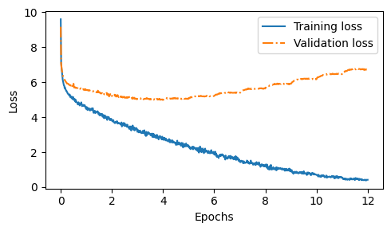

# Golpo-Kothok-GPT 📖

A complete GPT-2 style language model implementation built from scratch using PyTorch, trained on a diverse corpus of narrative stories. This project demonstrates a full end-to-end implementation of modern transformer-based language modeling, including custom implementations of multi-head attention, layer normalization, and the complete training pipeline.

## 🎯 Project Overview

Golpo-Kothok-GPT is a story generation model featuring:
- **From-scratch implementation**: Custom implementations of all major components (Multi-Head Attention, Layer Normalization, GELU, etc.)
- **Special tokens**: Support for `<|start|>`, `<|end|>`, `<|title|>`, and `</|title|>` tokens for structured story generation
- **Training optimizations**: Checkpoint system for Google Colab with periodic saving and resume capability
- **Generation features**: Temperature sampling, top-k sampling, and early stopping with custom EOS sequences  

### Training Results



*12 epochs of training showing convergence of training and validation loss*  


## 📊 Model Specifications

### Architecture Configuration

```python
GPT_CONFIG_124M = {
    "vocab_size": 50257,      # Vocabulary size (GPT-2 tokenizer)
    "context_length": 512,    # Context length (reduced from GPT-2's 1024)
    "emb_dim": 768,           # Embedding dimension
    "n_heads": 12,            # Number of attention heads
    "n_layers": 12,           # Number of transformer layers
    "drop_rate": 0.1,         # Dropout rate
    "qkv_bias": False,        # Query-Key-Value bias
    "key_dim": 768,           # Key dimension
    "val_dim": 768            # Value dimension
}
```

### Dataset Statistics

- **Total Characters**: 12,633,030
- **Total Tokens**: 3,049,258
- **Train/Val Split**: 90/10
- **Tokenizer**: tiktoken with GPT-2 encoding
- **Training Epochs**: 12
- **Batch Size**: 8
- **Total Training Time**: ~4.8 hours (Google Colab T4 GPU)
- **Data Source**: Curated collection of narrative stories gathered from various publicly available sources on the internet

**Note:** The dataset consists of diverse story content formatted with special tokens (`<|start|>`, `<|end|>`, `<|title|>`, `</|title|>`) for structured generation.

## 🏗️ Architecture Details

### Core Components (Implemented from Scratch)

1. **Multi-Head Attention**
   - Custom causal masking
   - Scaled dot-product attention
   - Head dimension: 64 (768/12)
   
2. **Feed-Forward Network**
   - Expansion factor: 4x (768 → 3072 → 768)
   - GELU activation (custom implementation)

3. **Layer Normalization**
   - Applied before attention and FFN (pre-norm)
   - Learnable scale and shift parameters

4. **Positional Encoding**
   - Learned positional embeddings
   - Maximum sequence length: 512 tokens

5. **Dropout**
   - Applied after attention, FFN, and embeddings
   - Rate: 0.1

### Model Architecture
- 12 transformer decoder layers
- 12 attention heads per layer
- 768-dimensional embeddings
- 512 token context window
- 50,257 token vocabulary (GPT-2 tokenizer)
- ~124M parameters

## 📁 Repository Structure

```
Golpo-Kothok-GPT/
├── data/
│   └── training_data.txt          # Story corpus with special tokens
├── output/                         # Generated story outputs
├── gpt_checkpoints/                # Model checkpoints (saved periodically)
├── Train Golpo Kothok GPT.ipynb   # Complete training pipeline
├── Test Golp Kothok GPT.ipynb     # Story generation and testing
├── utils.py                        # Core model components
│   ├── GPTModel                    # Main model class
│   ├── TransformerBlock            # Transformer layer
│   ├── MultiHeadAttention          # Custom attention implementation
│   ├── FeedForward                 # FFN with GELU
│   ├── LayerNorm                   # Custom normalization
│   ├── GELU                        # Activation function
│   ├── Dropout                     # Custom dropout
│   └── generate()                  # Text generation function
├── loss-plot.png                   # Training loss visualization
└── .gitignore
```

## 🚀 Getting Started

### Prerequisites

- Python 3.8+
- PyTorch 2.0+
- tiktoken
- numpy
- matplotlib (for plotting)

### Installation

```bash
# Clone the repository
git clone https://github.com/Ashfak-Uzzaman/Golpo-Kothok-GPT.git
cd Golpo-Kothok-GPT

# Install required packages
pip install torch tiktoken numpy matplotlib
```

### Data Preparation

Your training data should be formatted with special tokens:
```
<|start|>
<|title|>Your Story Title</|title|>

Your story content here...
<|end|>
```

### Training

1. **Fresh Training:**
   ```python
   # Open Train Golpo Kothok GPT.ipynb
   # Set your desired configuration
   num_epochs = 12
   batch_size = 8
   
   # Run training
   train_losses, val_losses, tokens_seen = start_fresh_training()
   ```

2. **Resume from Checkpoint:**
   ```python
   checkpoint_file = 'checkpoint_V1_2_epoch_6_step_3960.pt'
   train_losses, val_losses, tokens_seen = resume_training_from_checkpoint(
       checkpoint_dir, 
       checkpoint_file
   )
   ```

### Text Generation

```python
# Open Test Golp Kothok GPT.ipynb
# Load your trained model
model = GPTModel(GPT_CONFIG_124M)
load_checkpoint(model, checkpoint_path)

# Generate stories
generate_story(
    test_no=1,
    model=model,
    tokenizer=tokenizer,
    output_dir='./output',
    max_new_tokens=2000,
    temperature=1.2,  # Higher = more creative
    top_k=3           # Sampling from top-k tokens
)
```

## 📈 Training Details

### Training Configuration

- **Optimizer**: AdamW
  - Learning rate: 0.0004
  - Weight decay: 0.1
- **Batch size**: 8
- **Context length**: 512 tokens
- **Stride**: 512 (no overlap between training samples)
- **Train/Val split**: 90/10
- **Evaluation frequency**: Every 10 steps
- **Checkpoint saving**: After every epoch

### Training Progress

The model was trained for 12 epochs with the following observations:
- **Epoch 1-2**: Initial loss reduction (10.5 → 5.2)
- **Epoch 3-6**: Steady improvement (5.2 → 5.2 validation)
- **Epoch 7-12**: Fine-tuning phase (validation loss stabilized around 5.4-6.7)

Training losses and validation metrics are visualized in `loss-plot.png`.

### Checkpoint System

The training pipeline includes a robust checkpoint system:
```python
# Automatic checkpoint saving after each epoch
checkpoint = {
    'epoch': epoch,
    'global_step': global_step,
    'model_state_dict': model.state_dict(),
    'optimizer_state_dict': optimizer.state_dict(),
    'train_losses': train_losses,
    'val_losses': val_losses,
    'track_tokens_seen': track_tokens_seen,
    'tokens_seen': tokens_seen,
}
```

This allows training to resume seamlessly after interruptions (especially useful for Google Colab).

---
## 🪶 Sample Generated  

From a generation run without any prompt (starting from `<|start|>`):  
```
The Unyielding Flame of Courage

In the sprawling metropolis of Neo-Tokyo, a city that was not only a solitary
one, but a digital metropolis, far from the towering skyscrapers and the ever-
present threat of the world. The city was a sprawling metropolis where the rich
towering skyscrapers cast long, and the occasional chaos provided the most
advanced technology of technology and cultures. This was a world where the rich
and the air was blurred, and the rich clouds were not a physical entity but
merely slacker were the norm.

At the heart of the city was the city square, where towering skyscrapers and
hackers were the only buildings of the People. People were known for their
authority, nature, and their pursuit of knowledge, and their collective
consciousness often blurred. The city was a sprawling metropolis that existed in
the sky, with its towering skyscrapers and sprawling network that housed the
city's darkest secrets.

At the heart of the city was a man named Richard Hawkins, a talented group of
hackers who had dedicated his life to the betterment of humanity and fighting
against the oppressive forces that held them together. Victor was a beacon of
hope in a world plagued by darkness that lurked in the shadows.

Alex was a loner, a loner of the city's cybersecurity expert in cybernetic
enhancements. He had a natural intuition, a keen mind and a natural leader, a
master hacker who had managed to infiltrate the city's defenses. Victor's
ultimate goal was to perfect, and he was to have access to the true extent of
his plans.

To prevent such a catastrophic consequences, Victor had set to confront Victor
and his nefarious scheme. He assembled a team of skilled cybernetic
enhancements, including a skilled hacker operative, and fiercely loyalists, and
a former engineer. Together, they formed an unstoppable duo, fighting to restore
order and justice to the city's most critical infrastructure.

As the tension in the air was palpable, the team faced countless challenges and
obstacles, but through their determination and unity. They were the formidable
security team, driven by a sense of duty to the team and their unwavering belief
in their determination and the strength they faced.

Despite these challenges, teamwork, teamwork, and a shared determination to
protect the city and its people. They remained steadfast in their commitment to
their determination, their unwavering belief in the power of unity and the
unwavering belief that they were prepared for. Their story served as a testament
to the indomitable spirit of a united crime, a reminder that sometimes, the
struggle for the future of the countless innocent lives and the vulnerable to
the pursuit of justice.
```
With a custom prompt: `"There was a village"`  
```
There was a village on the outskirts of Eldoria. The villagers whispered about
the importance of faith and gratitude in the ways they made by allure.  As the
villagers listened in the village, so too did the change. For they were not so
sure and decided to give up on their faith and make the role of faith in the
villagers and the power of unity that bound within their land.  The villagers,
despite their differences, was a dark force, a malevolent spirit that had been
banished to the village by King Eldric and his minions. The once-great kingdom
now plagued by fear and despair, a sense of peace and tranquility, was now
filled with a newfound sense of peace and unity.  Eldron and his companions set
out to find a way to restore the lost kingdom and restore the lost kingdom to
its former glory. Along the way, they encountered many challenges and setbacks
along the way, but they remained steadfast in their resolve and the bonds of
friendship.  The first step was a long and arduous one, yet the village of
Elaria. The people of Eldora were known as the 'Celage of the Sun God and
Duchess', a group of sacred artifacts and wise men who had been sent by the
villagers to help them in aid of their battle.  Eleanor taught Flicker that the
people of Elders were in danger, and that the village was in grave danger. The
heroes of Eldora were the village's peace that had been restored, and they
believed could not be found by any force that sought to save their kingdom.
Eldari were determined to save their village and the people of Eldoria from the
clutches of the clutches of the evil that had been lost to the village's power.
They gathered on the most brave and wise and compassionate king, known as the
'Chosen One' prophesied in a battle that would be born from the ancient grove.
The villagers, led by the brave and resourceful Serpent King Aldric, agreed to
the ancient and protect the village from the ancient evil sorcerer. They
gathered their finest warriors and prepared for the coming battle to save their
home.  As the heroes prepared for the battle, the heroes fought valiantly, using
their combined skills and knowledge of ancient lore to defeat the evil sorcerer
and restore peace to the land. The heroes, with the help of a few trusted
allies, managed to defeat the sorcerer and banish the evil sorcerer and restore
peace to the kingdom.  The battle took them one by one, as the sun rose over the
horizon, driving back the dark forest to the shadows. The heroes were shocked by
the villagers and the grateful King spirit, and the villagers, who had saved
their village from the darkness that threatened to consume it.  As the sun began
to set, the darkness that had plagued the village began to recede, the villagers
could begin to recede, but the darkness could not be in vain. The darkness that
had plagued the village began to recede, and the darkness that had plagued the
village began to recede, the villagers, driving the village and banishing the
darkness that had been cast in darkness.  The villagers, grateful for the hero's
sacrifice had saved, but the villagers remained a constant reminder of the
darkness that had befall their village. The end.  As the sun set on the village,
the villagers gathered in the village square, their hearts filled with hope and
determination. They knew that the darkness had been restored, and the heroes
they had saved, but the darkness that had restored the village for all.  The
End.   The villagers, grateful for the heroes' sacrifices had saved, but the
darkness that had restored the village and had saved the village from the
darkness that threatened to consume it. The darkness that had restored the
village would one village for a hero, a hero would be remembered for the hero
who had saved, and a hero would be remembered for the heroes who had saved.  The
end. <|book_end|>
```

## 🔮 Current Status & Limitations

### What Works
- ✅ Complete transformer architecture implemented from scratch
- ✅ Successful training on 3M+ token corpus
- ✅ Text generation with temperature and top-k sampling
- ✅ Special token support for structured stories
- ✅ Checkpoint system for training resumption

### Limitations
- ⚠️ The output quality may not be good and there may be a lack of consistency  
- ⚠️ Limited context window (512 tokens vs. GPT-2's 1024)
- ⚠️ Relatively small training dataset (12.6M characters)
- ⚠️ Generation can be repetitive without careful hyperparameter tuning
- ⚠️ Require fine-tuning for specific story genres

### Known Issues
- Model tends to repeat phrases in longer generations
- Story structure can lose coherence after ~500 tokens
- Character and plot consistency needs improvement

<!-- ## 🛠️ Future Improvements

### Short-term
- [ ] Increase training epochs (20-30 epochs)
- [ ] Implement learning rate scheduling (cosine annealing)
- [ ] Add gradient clipping for training stability
- [ ] Experiment with different dropout rates
- [ ] Implement nucleus (top-p) sampling

### Medium-term
- [ ] Expand dataset with more diverse stories
- [ ] Extend context length to 1024 tokens
- [ ] Add beam search for better generation quality
- [ ] Implement repetition penalty
- [ ] Fine-tune on specific story genres (sci-fi, fantasy, etc.)

### Long-term
- [ ] Scale to GPT-2 Medium (350M parameters)
- [ ] Implement model quantization for efficiency
- [ ] Add instruction fine-tuning capabilities
- [ ] Create a web interface for story generation
- [ ] Implement RLHF for better alignment -->

## 📚 Technical Details

### Custom Implementations

All core components are implemented from scratch in `utils.py`:

1. **Multi-Head Attention**: Custom scaled dot-product attention with causal masking
2. **Layer Normalization**: Learnable scale/shift parameters with epsilon for stability
3. **GELU Activation**: Gaussian Error Linear Unit using tanh approximation
4. **Dropout**: Training/inference mode switching with proper scaling
5. **Softmax**: Numerically stable implementation with max subtraction

### Data Processing

```python
class GPTDataset(Dataset):
    """
    Creates overlapping sequences using sliding window approach
    - Tokenizes entire corpus once
    - Uses stride to create training examples
    - Automatically handles special tokens
    """
```

### Generation Strategy

The model supports multiple generation techniques:
- **Greedy decoding** (temperature=0): Always picks highest probability token
- **Temperature sampling**: Controls randomness (higher = more creative)
- **Top-k sampling**: Samples from k most likely tokens
- **Early stopping**: Stops generation when `<|end|>` sequence is detected

Example generation settings:
```python
# Conservative generation
temperature=0.7, top_k=10

# Creative generation  
temperature=1.2, top_k=3

# Deterministic generation
temperature=0.0
```

## 🤝 Contributing

Contributions, issues, and feature requests are welcome! Feel free to check the issues page or submit a pull request.

## 📝 License

This project is open source and available for educational purposes.

## 👨‍💻 Author

**Ashfak Uzzaman**
- GitHub: [@Ashfak-Uzzaman](https://github.com/Ashfak-Uzzaman)

## 🙏 Acknowledgments

### Learning Resources

This project was built following the excellent YouTube tutorial series on implementing GPT from scratch:
- **Tutorial Playlist:** [Building LLMs from scratch](https://youtube.com/playlist?list=PLPTV0NXA_ZSgsLAr8YCgCwhPIJNNtexWu&si=COExYLqW9QBlEe5j)

Special thanks to [Vizuara.ai](https://vizuara.ai/) and [Raj Abhijit Dandekar](https://www.linkedin.com/in/raj-abhijit-dandekar-67a33118a/) for making complex transformer architectures accessible through clear explanations and step-by-step implementation guidance.

### Technical Foundations

- **Architecture:** Inspired by OpenAI's GPT-2 architecture and the seminal ["Attention Is All You Need"](https://arxiv.org/abs/1706.03762) paper
- **Framework:** Built using [PyTorch](https://pytorch.org/) deep learning framework
- **Tokenization:** Powered by OpenAI's [tiktoken](https://github.com/openai/tiktoken) library
- **Training Infrastructure:** Google Colab with T4 GPU

### Community

Thanks to the open-source community for providing excellent tools and resources that made this project possible.

---

⭐ If you find this project interesting, please consider giving it a star!